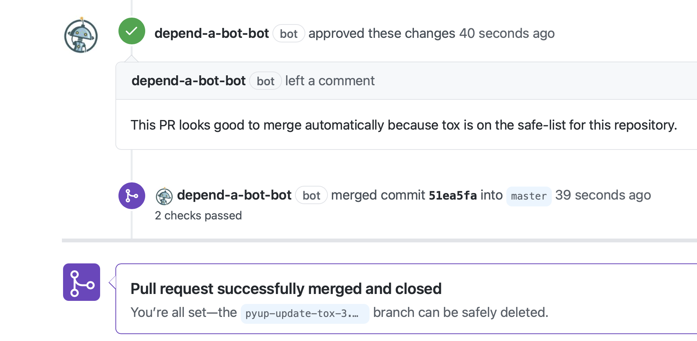

# dependabot-bot

A bot for GitHub that automatically merges PRs from dependabot when they meet certain criteria:

- All the checks are passing
- The package is on a safe-list



## Installation

Go to [github.com/apps/depend-a-bot-bot](https://github.com/apps/depend-a-bot-bot) to install.

## Configuration

In your repository, create a file `.github/dependabot-bot.yml` after installing the dependabot-bot application.

The `safe` property should be a list of packages allowed to be merged automatically.

```yaml
safe:
 - package-1
 - package-2 
```

## About

This bot is powered by [Python Serverless technologies on Azure Functions](https://docs.microsoft.com/azure/azure-functions/functions-reference-python?WT.mc_id=python-16102-anthonyshaw).

The bot was written by Anthony Shaw and the source code is available at [github.com/tonybaloney/dependabot-bot](https://github.com/tonybaloney/dependabot-bot)